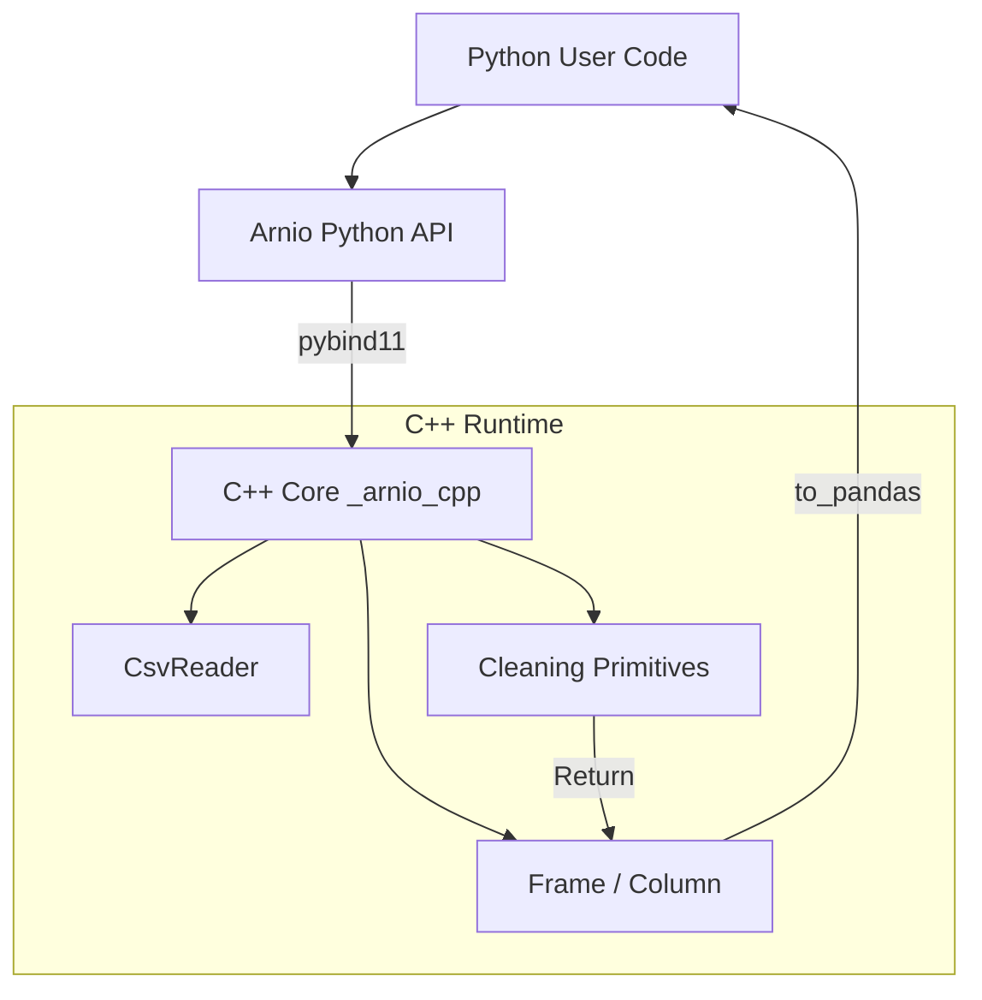

# Arnio Architecture

Arnio is designed to provide high-performance, memory-efficient data ingestion and cleaning by leveraging C++ while maintaining a seamless, declarative Python API.

This document outlines the core architecture and the boundary between Python and C++.

## 1. The Core Philosophy

Data preprocessing often involves operations that are inherently slow in Python (e.g., string manipulation, repeated passes over data). Arnio solves this by:
1. **Loading data directly into C++ memory structures.**
2. **Performing all cleaning operations natively in C++ without Python GIL contention.**
3. **Translating the final, pristine dataset to a pandas DataFrame via a zero-copy (or near zero-copy) boundary.**

## 2. Python ↔ C++ Boundary

The boundary is managed using [`pybind11`](https://github.com/pybind/pybind11). 

The C++ core is compiled into a Python extension module (`_arnio_cpp`). The Python API (in `arnio/`) serves as a lightweight, type-hinted wrapper around this compiled extension.

## 3. Data Model

Arnio's data model is columnar, strongly resembling Apache Arrow or modern Pandas internals.

### `Column`
A `Column` represents a single 1D array of homogeneous data.
- **Variant Storage**: Data is stored using `std::variant` over strongly-typed `std::vector`s (e.g., `std::vector<int64_t>`, `std::vector<std::string>`).
- **Null Handling**: Nulls are tracked via a separate boolean mask (`std::vector<bool>`), allowing the underlying data vectors to remain dense and cache-friendly.

### `Frame`
A `Frame` is an ordered collection of `Column` objects, representing a 2D dataset.
- The `Frame` maintains an index mapping column names to their respective `Column` objects for `O(1)` access.

## 4. Pandas Dtype Compatibility

Arnio supports a focused set of pandas dtypes directly through its native C++ columnar model. Some advanced pandas dtypes are currently handled through conversion or have limited support depending on the workflow.

This section describes the current implementation status for each dtype category.

### Fully Supported

The following dtypes are natively supported and map efficiently to strongly typed C++ vectors:

- `int64`
- `float64`
- `bool`
- `string`

These allow efficient parsing, cleaning operations, and zero-copy or near zero-copy conversion back to pandas where possible.

### Limited Support

The following dtypes are not natively supported but may work through conversion or partial compatibility layers depending on the workflow:

- `category`
- mixed `object` columns
- nullable pandas dtypes such as `Int64` and `boolean`

Categorical columns may be converted to string/object representations during processing. Mixed object columns can reduce type inference reliability. Nullable pandas dtypes are partially supported through pandas extension dtypes and existing null-mask handling.

### Unsupported

The following dtypes are currently unsupported in the native runtime:

- `datetime64[ns]`
- `timedelta64[ns]`

These require additional parsing and inference support in the C++ runtime and are not yet available.

### User-facing Behavior

When unsupported or partially supported dtypes are encountered, Arnio should provide clear user-facing errors instead of silent failures.

For best performance and compatibility, users are encouraged to prefer strongly typed columns such as `int64`, `float64`, `bool`, and `string`.

## 5. Pipeline Execution

The `pipeline()` function in Python accepts a list of declarative steps. 

1. **Step Registry**: Arnio maintains a registry mapping string names (e.g., `"strip_whitespace"`) to function pointers.
2. **C++ Execution**: For natively supported operations, the Python wrapper calls the C++ function directly, passing the `Frame` pointer. The operation modifies the data or returns a new `Frame` entirely within C++.
3. **Python Fallback**: If a step is registered via pure Python (`ar.register_step()`), the `Frame` is temporarily converted to a pandas DataFrame, the Python function executes, and the result is converted back. *(Note: This incurs a conversion penalty and is intended for prototyping or operations not yet supported in C++).*

## CSV Parsing Limitations and Troubleshooting

Arnio follows standard RFC 4180-style CSV parsing behavior. Malformed CSV input may raise parsing errors or produce inconsistent results.

Common unsupported or problematic cases include:

- Unclosed or malformed quoted fields
- Inconsistent row widths
- Delimiter mismatches
- Missing header rows
- Non-UTF-8 encoded files
- Binary or corrupted input files

For practical examples and fixes, see:
- [Bad CSV Troubleshooting Guide](docs/bad_csv_troubleshooting.md)

## 6. Converting to Pandas

The `to_pandas()` function is the most critical boundary. It uses the NumPy C-API (via pybind11's buffer protocol) to expose the underlying C++ `std::vector` memory directly to pandas, avoiding expensive element-by-element copies where possible (zero-copy for numerics and booleans). String columns currently require instantiation of Python `str` objects.
