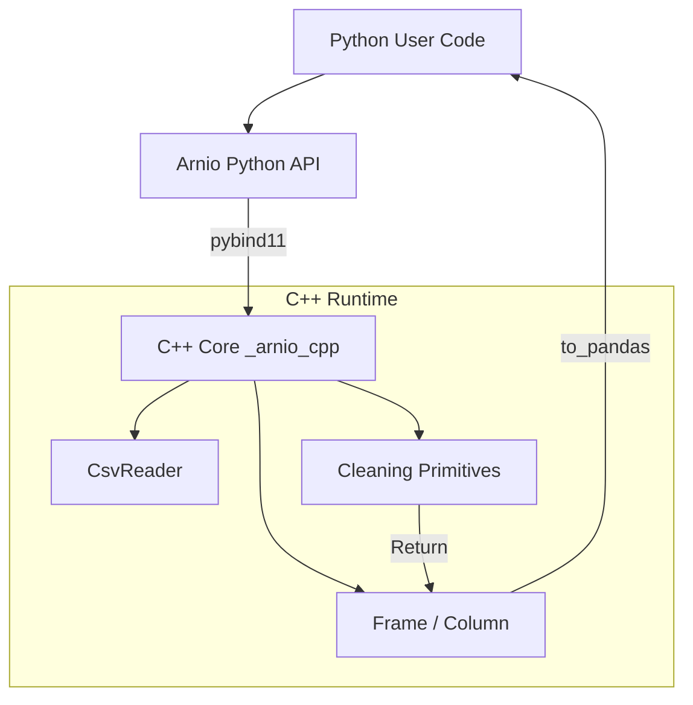
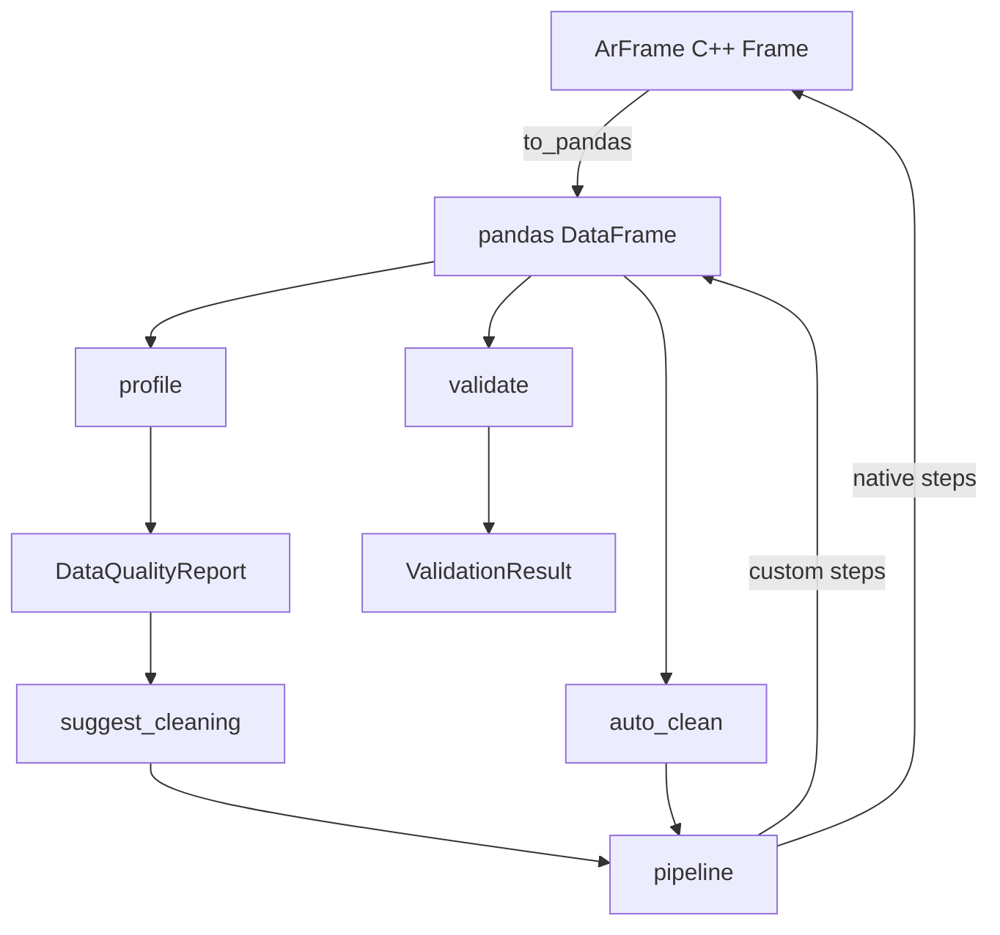

# Arnio Architecture

Arnio is designed to provide high-performance, memory-efficient data ingestion and cleaning by leveraging C++ while maintaining a seamless, declarative Python API.

This document outlines the core architecture and the boundary between Python and C++.

## 1. The Core Philosophy

Data preprocessing often involves operations that are inherently slow in Python (e.g., string manipulation, repeated passes over data). Arnio solves this by:
1. **Loading data directly into C++ memory structures.**
2. **Performing all cleaning operations natively in C++ without Python GIL contention.**
3. **Translating the final, pristine dataset to a pandas DataFrame via a zero-copy (or near zero-copy) boundary.**

## 2. Python ↔ C++ Boundary

The boundary is managed using [`pybind11`](https://github.com/pybind/pybind11). 

The C++ core is compiled into a Python extension module (`_arnio_cpp`). The Python API (in `arnio/`) serves as a lightweight, type-hinted wrapper around this compiled extension.

## 3. Data Model

Arnio's data model is columnar, strongly resembling Apache Arrow or modern Pandas internals.

### `Column`
A `Column` represents a single 1D array of homogeneous data.
- **Variant Storage**: Data is stored using `std::variant` over strongly-typed `std::vector`s (e.g., `std::vector<int64_t>`, `std::vector<std::string>`).
- **Null Handling**: Nulls are tracked via a separate boolean mask (`std::vector<bool>`), allowing the underlying data vectors to remain dense and cache-friendly.

### `Frame`
A `Frame` is an ordered collection of `Column` objects, representing a 2D dataset.
- The `Frame` maintains an index mapping column names to their respective `Column` objects for `O(1)` access.

## 4. Pipeline Execution

The `pipeline()` function in Python accepts a list of declarative steps. 

1. **Step Registry**: Arnio maintains a registry mapping string names (e.g., `"strip_whitespace"`) to function pointers.
2. **C++ Execution**: For natively supported operations, the Python wrapper calls the C++ function directly, passing the `Frame` pointer. The operation modifies the data or returns a new `Frame` entirely within C++.
3. **Python Fallback**: If a step is registered via pure Python (`ar.register_step()`), the `Frame` is temporarily converted to a pandas DataFrame, the Python function executes, and the result is converted back. *(Note: This incurs a conversion penalty and is intended for prototyping or operations not yet supported in C++).*

## 5. Converting to Pandas

The `to_pandas()` function is the most critical boundary. It uses the NumPy C-API (via pybind11's buffer protocol) to expose the underlying C++ `std::vector` memory directly to pandas, avoiding expensive element-by-element copies where possible (zero-copy for numerics and booleans). String columns currently require instantiation of Python `str` objects.

## 6. Data Quality and Schema Validation

All four functions profile, suggest_cleaning, auto_clean, and validate are Python/pandas based. They convert ArFrame to a pandas DataFrame via to_pandas() first, then do their work in Python.

What each function does

1. profile: converts ArFrame to pandas, then checks each column for things like null values, duplicate rows, data types, and unique value counts. Returns a DataQualityReport object.

2. suggest_cleaning: runs profile first, looks at the results, and returns a list of cleaning steps like strip_whitespace or drop_nulls that you can pass directly to pipeline.

3. auto_clean: does the same as suggest_cleaning but also runs those steps automatically through pipeline. The pipeline then sends native steps to C++ and Python-only steps through pandas.

4. validate: converts ArFrame to pandas, then checks each column against rules you define in a Schema. Things like "this column can't be null" or "this column must have valid email addresses". Returns a ValidationResult with any issues found.

Arnio is split into two layers.
- The C++ layer handles the heavy work: parsing CSVs, storing data, and cleaning operations like drop_nulls and strip_whitespace. These run fast because they go through pybind11 directly into C++. 
- The Python/pandas layer handles data quality: profiling, validation, and schema checks. These functions first convert the ArFrame to pandas using to_pandas() and then do their work in normal Python.