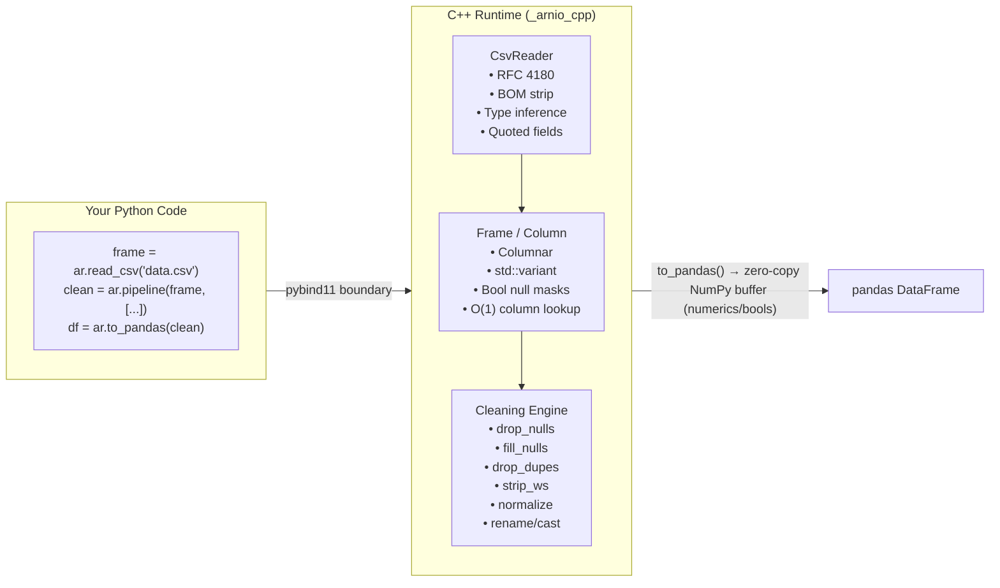

<div align="center">

<br>

<picture>
  <source media="(prefers-color-scheme: dark)" srcset="final-icon-dark.svg">
  
</picture>

<br><br>

### Fast data preparation for the Python data stack.

<br>

**Arnio** is a compiled C++ data preparation engine for messy CSV and pandas workflows.<br>
It parses, infers types, strips whitespace, deduplicates, validates, and profiles data —<br>
then hands clean results back to the tools you already use.<br>
Use Arnio _before_ and _alongside_ pandas, NumPy, scikit-learn, DuckDB, and Arrow.

<br>


<a href="https://pypi.org/project/arnio/"></a>&nbsp;
<a href="https://pypi.org/project/arnio/"></a>&nbsp;
<a href="https://github.com/im-anishraj/arnio/actions/workflows/ci.yml"></a>&nbsp;
<a href="https://codecov.io/gh/im-anishraj/arnio"></a>&nbsp;
<a href="LICENSE"></a>&nbsp;
<a href="https://gssoc.girlscript.tech/"></a>&nbsp;
<a href="https://discord.gg/xsEw7r78M"></a>
[](https://pepy.tech/projects/arnio)
[](https://github.com/im-anishraj/arnio.git)
<br><br>

```bash
pip install arnio
```

Colab install smoke test: **[COLAB_SMOKE_TEST.md](COLAB_SMOKE_TEST.md)**

<br>

<a href="#-quickstart">Quickstart</a>&ensp;·&ensp;<a href="#-integrations">Integrations</a>&ensp;·&ensp;<a href="#-why-arnio-exists">Why Arnio</a>&ensp;·&ensp;<a href="#%EF%B8%8F-architecture">Architecture</a>&ensp;·&ensp;<a href="#-benchmarks">Benchmarks</a>&ensp;·&ensp;<a href="#-community">Community</a>&ensp;·&ensp;<a href="#-contribute">Contribute</a>

</div>

### System Architecture

The following diagram illustrates the internal workflow and architecture of Arnio.


<br>

---

<br>

## ⚡ Quickstart

If you're new to Arnio, the example below demonstrates a simple first-run workflow for loading, cleaning, and preparing CSV data before converting it back into a pandas DataFrame.
The workflow starts by loading a CSV dataset into an Arnio frame for preprocessing and cleaning.

```python
import arnio as ar

# Load CSV directly through C++ — no Python parsing overhead
frame = ar.read_csv("messy_sales_data.csv")

# Strict mode (default) fails on inconsistent row widths
frame = ar.read_csv("messy_sales_data.csv", mode="strict")

# Permissive mode fills missing trailing values with nulls
frame = ar.read_csv("messy_sales_data.csv", mode="permissive")
```

Each pipeline step applies a specific transformation such as trimming whitespace, normalizing text formatting, handling missing values, and removing duplicate rows.


```python
# Declare what clean data looks like — arnio handles the rest
clean = ar.pipeline(frame, [
    ("strip_whitespace",),
    ("normalize_case", {"case_type": "lower"}),
    ("fill_nulls", {"value": 0.0, "subset": ["revenue"]}),
    ("make_column_names_unique",),
    ("drop_nulls",),
    ("drop_duplicates",),
])
```

Already have a pandas `DataFrame`? Use Arnio in-place in your existing pandas
workflow:

```python
import pandas as pd
import arnio as ar

df = pd.read_csv("messy_sales_data.csv")

clean_df = df.arnio.clean([
    ("strip_whitespace",),
    ("normalize_case", {"case_type": "lower"}),
    ("drop_duplicates",),
])
`df.arnio.clean()` supports both pipeline-based cleaning steps and keyword-based convenience operations such as `drop_duplicates=True`.
report = clean_df.arnio.profile()
```

### Select specific columns

Use `select_columns()` to create a new `ArFrame` with only the required columns before converting to pandas.

```python
selected = frame.select_columns(["name", "revenue"])

print(selected.columns)
# ['name', 'revenue']
```


> Every step above executes in C++. Your Python code is a _configuration_ — not the execution engine.

> Explore more in the **[examples/](./examples/)** folder — ready-to-run recipes for sales, customers, survey, logs, and finance datasets.

<br>

### Security note: CSV formula injection

Arnio preserves cell values by default when writing CSV files. It does not rewrite
strings that begin with spreadsheet formula prefixes such as `=`, `+`, `-`, or `@`
unless you opt in to formula escaping.

If you export Arnio-cleaned data back to CSV and expect users to open that file in
Excel, Google Sheets, LibreOffice, or another spreadsheet application, treat
untrusted text fields as potentially executable spreadsheet formulas. Use
`escape_formulas=True` when exporting user-controlled text to prefix formula-like
string cells with a single quote while leaving numeric columns unchanged:

```python
ar.write_csv(clean_frame, "safe_export.csv", escape_formulas=True)
```

This is especially important for customer names, notes, comments, imported form
fields, and any other free-text values that may come from outside your trust
boundary. Arnio keeps the export policy explicit, so existing CSV output remains
unchanged unless this option is enabled.

<br>

## Error Handling

### `read_csv` and `scan_csv`

| Input | Raises | Message |
|:---|:---|:---|
| File not found | `CsvReadError` | `Cannot open file: <path>` |
| Zero-byte file | `CsvReadError` | `CSV file is empty: '<path>'` |
| Blank header line | `CsvReadError` | `CSV header contains an empty column name` |
| Binary / NUL bytes | `CsvReadError` | `CSV input contains NUL bytes and appears to be binary or corrupted` |

### Schema Validation

`ar.validate()` returns a `ValidationResult`; it does not raise for validation failures. Check `result.passed` and `result.issues` for `dtype` or `required_column` rule violations.

`validate()` currently operates on a single in-memory `ArFrame`. Chunked validation via `read_csv_chunked()` iterators is not yet supported directly. Validate each chunk individually or materialize the data before validation when working with streamed/chunked inputs.

### Pipeline Step Errors

Unknown step names raise `UnknownStepError` before execution begins.

<details>
<summary><b>📸 Peek at a 100 GB file without loading it</b></summary>
<br>

`scan_csv` reads only the header + a sample to infer the schema. Zero data loaded.

```python
# Pass sample_size to control how many rows are evaluated for type inference
schema = ar.scan_csv("100GB_file.csv", sample_size=500)
# {'id': 'int64', 'name': 'string', 'is_active': 'bool', 'revenue': 'float64'}
```

```python
schema_info = ar.scan_csv(
    "100GB_file.csv",
    sample_size=500,
    return_metadata=True,
)

print(schema_info)

# {
#     "schema": {
#         "id": "int64",
#         "name": "string",
#         "is_active": "bool",
#         "revenue": "float64",
#     },
#     "metadata": {
#         "delimiter": ",",
#         "encoding": "utf-8",
#         "sampled_rows": 500,
#     },
# }
```
`sampled_rows` reports the actual number of data rows sampled during schema
inference, which may be smaller than `sample_size` for short files.

Useful for exploring datasets before committing memory.
</details>

<details>
<summary><b>👀 Preview rows without pandas conversion or full-column Python list materialization</b></summary>
<br>

`preview()` reads only the first `n` rows directly from the C++ frame — no pandas conversion triggered.

```python
frame = ar.read_csv("huge_file.csv")

print(frame.preview())      # first 5 rows (default)
print(frame.preview(n=10))  # first 10 rows
```

Raises `ValueError` for invalid `n` (zero, negative, or non-integer).
</details>

<details>
<summary><b>🧩 Add custom steps without touching C++</b></summary>
<br>

Register any Python function as a pipeline step. It receives a `DataFrame`, returns a `DataFrame`.

```python
def remove_outliers(df, column="revenue", threshold=100_000):
    return df[df[column] <= threshold]

ar.register_step("remove_outliers", remove_outliers)
ar.register_step("team:drop_nulls", remove_outliers)  # namespaced custom step

# Use builtin: for an explicit built-in step, and your own prefixes
# like team: or plugin_name: to avoid name collisions.

# Introspect built-in and custom step names without reaching into internals.
print(ar.list_steps())

# Opt in to a context object only when you need execution metadata.
def capture_context(df, context=None):
    print(context.step_name, context.step_index, context.total_steps)
    return df

# Now use it in any pipeline alongside native C++ steps
clean = ar.pipeline(frame, [
    ("builtin:strip_whitespace",),
    ("remove_outliers", {"column": "revenue", "threshold": 50000}),
    ("drop_duplicates",),
])
```

Need to inspect the built-in kwargs a step accepts before assembling a pipeline?

```python
signatures = ar.get_builtin_step_signatures()
print(list(signatures["drop_nulls"].parameters))  # ["subset"]
print(list(signatures["filter_rows"].parameters))  # ["column", "op", "value"]
```

Need to restore the registry back to built-in steps only during tests?

```python
ar.reset_steps()

print(ar.list_steps())
# Only built-in steps remain
```

Custom steps run through a pandas↔ArFrame conversion bridge. Prototype in Python, then optionally migrate hot paths to C++ for full speed.
</details>

### 🧾 ArFrame column helpers

`ArFrame` includes lightweight helpers for safe column introspection:

```python
frame.has_column("revenue")        # True/False
frame.get_column_dtype("revenue")  # e.g. "float64"
```

`get_column_dtype()` raises `KeyError` if the column does not exist.

<br>

---

<br>

## 🔗 Integrations

Arnio is designed to make the rest of the Python data stack more productive,
not to replace it.

| Workflow | How Arnio helps |
|:---|:---|
| **pandas** | Clean, validate, and profile messy `DataFrame`s through `df.arnio`. |
| **NumPy** | Prepare typed numeric data before array/modeling workflows. |
| **scikit-learn** | Use Arnio cleaning as a preprocessing layer before model training. |
| **DuckDB / Arrow** | Validate and prepare data before analytics and columnar exchange. |
| **notebooks** | Inspect quality issues and cleaning suggestions before analysis. |

### DuckDB registration

Use `ar.register_duckdb(frame, conn, "table_name")` to register an ArFrame directly as a DuckDB relation without writing pandas conversion glue yourself. DuckDB is an optional dependency — install it with `pip install duckdb` when needed.

```python
import duckdb
import arnio as ar

frame = ar.read_csv("data.csv")
conn = duckdb.connect()
ar.register_duckdb(frame, conn, "my_table")
result = conn.execute("SELECT * FROM my_table").fetchdf()
```

### Row-dropping pipeline behavior

Some pipeline steps such as `drop_nulls` or `drop_duplicates`
can change the number of rows returned during `transform`.

By default, `ArnioCleaner` raises a `ValueError` if a pipeline
changes row count during transform because many scikit-learn
workflows expect input and output sample counts to remain aligned.

If row-dropping behavior is intentional, pass
`allow_row_count_change=True` when constructing `ArnioCleaner`.

```python
cleaner = ar.ArnioCleaner(
    steps=[...],
    allow_row_count_change=True,
)
```

### Pandas accessor

```python
df = pd.read_csv("raw_customers.csv")

clean_df = df.arnio.clean(drop_duplicates=True)
quality = clean_df.arnio.profile()
validation = clean_df.arnio.validate({
    "email": ar.Email(nullable=False),
    "age": ar.Int64(nullable=True, min=0),
})
```
The accessor automatically converts dictionary-based validation rules into an internal `ar.Schema` instance.


This keeps pandas as the analysis tool while Arnio handles the preparation,
quality, and validation layer.

> Product direction: **[PROJECT_DIRECTION.md](PROJECT_DIRECTION.md)**

<br>

---

<br>

## 🔍 Why Arnio exists

Every data project starts the same way:

```python
df = pd.read_csv("data.csv")              # 💥 RAM spike — entire file as raw strings
df.columns = df.columns.str.strip()        # Why is this not automatic?
df["name"] = df["name"].str.strip()        # Python loop over every cell
df["name"] = df["name"].str.lower()        # Another Python loop
df = df.dropna(subset=["revenue"])         # Another pass
df = df.drop_duplicates()                  # Another pass
```

Six lines. Four full-data passes. All in interpreted Python. This is fine for a Jupyter demo — but it doesn't scale, it doesn't compose, and it definitely doesn't belong in production.

**Arnio intercepts this entire pattern.** It moves the preparation layer into a predictable pipeline, accelerates supported operations in C++, and gives you clean data for pandas, NumPy, scikit-learn, DuckDB, or notebooks.

<table>
<tr>
<td width="50%">

### Without Arnio
```python
df = pd.read_csv(path)
df.columns = df.columns.str.strip()
for col in str_cols:
    df[col] = df[col].str.strip()
    df[col] = df[col].str.lower()
df = df.dropna(subset=["revenue"])
df = df.drop_duplicates()
# 6+ lines, multiple passes, pure Python
```

</td>
<td width="50%">

### With Arnio
```python
frame = ar.read_csv(path)
df = ar.to_pandas(ar.pipeline(frame, [
    ("strip_whitespace",),
    ("normalize_case", {"case_type": "lower"}),
    ("drop_nulls", {"subset": ["revenue"]}),
    ("drop_duplicates",),
]))
# Declarative. Single pipeline. C++ execution.
```

</td>
</tr>
</table>

<br>

---

<br>

## 🏗️ Architecture

Arnio is not a pandas wrapper. It's a separate runtime with its own data model.



### Design decisions that matter

| Decision | What it means |
|:---|:---|
| **Columnar storage** | Data lives in typed `std::vector`s — `vector<int64_t>`, `vector<double>`, `vector<string>` — not rows of variants. Cache-friendly and SIMD-ready. |
| **Boolean null masks** | Nulls are tracked in a separate `vector<bool>`, keeping data vectors dense. No sentinel values, no NaN tricks. |
| **Two-pass CSV read** | Pass 1 infers types across all rows. Pass 2 parses values directly into the correct typed column. No string→object→cast overhead. |
| **Zero-copy bridge** | `to_pandas()` exposes C++ memory directly via NumPy's buffer protocol where supported. Numeric columns preserve the fast zero-copy path by default, while `copy=True` requests defensive pandas-owned buffers. |
| **Step registry** | Built-in and native steps use the C++ core via `_STEP_REGISTRY`; Python-backed built-ins dispatch through `_PYTHON_STEP_REGISTRY`; custom user-defined steps follow the same Python registry path. Adding a new cleaning primitive is a single function + one registry entry. |

> Full architecture documentation: **[ARCHITECTURE.md](ARCHITECTURE.md)**
> API reference guide: **[Arnio API Reference](./API_REFERENCE.md)**

<br>

---

<br>

## 🏎️ Benchmarks

> **Reference environment**: Ubuntu, Python 3.12, synthetic messy CSV inputs.<br>
> **Reproduce**: `make benchmark` — generates deterministic tall and wide datasets and runs both engines.

To reproduce the published numbers from a fresh checkout:

```bash
python -m venv .venv
source .venv/bin/activate
python -m pip install -U pip
python -m pip install -e .
python benchmarks/generate_data.py
python benchmarks/benchmark_vs_pandas.py
```

`benchmarks/generate_data.py` uses deterministic NumPy seeds, so every run creates the same `benchmarks/benchmark_1m.csv` tall input and `benchmarks/benchmark_wide.csv` wide input. The benchmark then executes three pandas runs and three arnio runs for each case, printing average wall-clock time from `time.perf_counter()` and peak Python allocation from `tracemalloc`. For cleaner comparisons, close other memory-heavy processes and run the script from the repository root after installing the same Python, pandas, NumPy, compiler, and arnio commit you want to compare.

Expected output format:

```text
Tall CSV (1,000,000 rows x 12 columns)
Metric                     pandas        arnio
────────────────────────────────────────────
Exec Time (avg)       4.73s         5.75s
Peak RAM               211MB         212MB
Speed: 0.8x | RAM: -1% reduction

Wide CSV (5,000 rows x 256 columns)
Metric                     pandas        arnio
────────────────────────────────────────────
Exec Time (avg)       ...s          ...s
Peak RAM              ...MB         ...MB
Speed: ...x | RAM: ...% reduction
```

Small differences are expected across CPUs, operating systems, compilers, Python builds, and pandas/NumPy versions. If you share benchmark results in an issue or PR, include your OS, Python version, CPU model, pandas/NumPy versions, arnio commit, and the full command output so maintainers can compare like for like.

**Arnio is near memory parity in the reference benchmark** while replacing ad-hoc Python string loops with a compiled, declarative pipeline. Validate memory and speed on your own workload. The execution time gap is a known, active optimization target — the current `drop_duplicates` and `strip_whitespace` implementations use unoptimized row-key serialization.

<table>
<tr>
<td>✅ <b>What's already won</b></td>
<td>🎯 <b>What's being optimized</b></td>
</tr>
<tr>
<td>

- Native C++ parsing eliminates Python memory spikes
- Columnar storage matches pandas' internal efficiency
- Declarative API eliminates `.apply()` spaghetti
- Zero-copy bridge for numeric conversions

</td>
<td>

- `drop_duplicates` — replace string serialization with hash-based comparisons
- `strip_whitespace` — in-place mutation instead of copy-on-write
- Parallel column processing via `std::thread`
- **[Help close the gap →](https://github.com/im-anishraj/arnio/issues)**

</td>
</tr>
</table>

<br>

### 🧠 Auto Clean Memory Benchmark

To measure the peak memory and execution time of the `auto_clean` pipeline using realistic dataset sizes:

```bash
python benchmarks/benchmark_auto_clean_memory.py --rows 100000
```

This script generates a reproducible synthetic dataset with mixed column types (strings, ints, floats, booleans, nulls, and duplicates) and measures:
- `ar.read_csv` performance
- `ar.auto_clean(mode="safe")` performance (low-risk cleanup like whitespace trimming)
- `ar.auto_clean(mode="strict")` performance (includes type casting and deduplication)

The dataset is regenerated deterministically unless `--reuse-file` is provided.
Each `auto_clean` benchmark run reloads the dataset to avoid mutation or caching effects between runs.

Options:
- `--repeat N` runs each operation multiple times and reports average (and min/max range).
- `--seed N` changes the deterministic dataset seed.
- `--reuse-file` reuses an existing dataset file instead of regenerating it.
- `--keep-file` keeps the generated CSV (otherwise it is removed at the end).

Expected output format:

```text
Operation                    Time(s)     Peak Py(MiB)
--------------------------------------------------------------------
ar.read_csv           0.042 (0.041-0.044)    4.52 (4.50-4.60)
ar.auto_clean(safe)   0.012 (0.011-0.013)    0.15 (0.14-0.16)
ar.auto_clean(strict) 0.035 (0.034-0.036)    1.20 (1.18-1.22)
--------------------------------------------------------------------
Total avg (Read+Strict)       0.077             4.52
```
<br>

---

<br>

## 🧰 Cleaning primitives

Most operations below run natively in C++. Currently, `filter_rows`, `replace_values` and `standardize_missing_tokens` run via the Python (pandas) backend and may be optimized in C++ later.

| Primitive | What it does | Example |
|:---|:---|:---|
| `drop_nulls` | Remove rows with null/empty values | `ar.drop_nulls(frame, subset=["age"])` |
| `validate_columns_exist` | Fail early when required columns are missing | `ar.validate_columns_exist(frame, ["age"])` |
| `filter_rows` | Filter rows using comparison operators | `ar.filter_rows(frame, column="age", op=">", value=18)` |
| `fill_nulls` | Replace nulls with a scalar | `ar.fill_nulls(frame, 0, subset=["revenue"])` |
| `drop_duplicates` | Deduplicate rows (first/last/none) | `ar.drop_duplicates(frame, keep="first")` |
| `drop_constant_columns` | Remove columns with only one unique value | `ar.drop_constant_columns(frame)` |
| `clip_numeric` | Clip numeric values to lower and/or upper bounds | `ar.clip_numeric(frame, lower=0, upper=100)` |
| `strip_whitespace` | Trim leading/trailing spaces from strings | `ar.strip_whitespace(frame)` |
| `collapse_rare_categories` | Group rare string categories into a single label based on frequency | `ar.collapse_rare_categories(frame, column="city", threshold=0.02, fill_value="Other")` |
| `standardize_missing_tokens` | Replace common missing-value strings with NaN | `ar.standardize_missing_tokens(frame)` |
| `normalize_case` | Force lower/upper/title case | `ar.normalize_case(frame, case_type="title")` |
| `rename_columns` | Rename columns via mapping | `ar.rename_columns(frame, {"old": "new"})` |
| `drop_columns` | Remove specified columns from the frame | `frame.drop_columns(["col1", "col2"])` |
| `cast_types` | Cast column types | `ar.cast_types(frame, {"age": "int64"})` |
| `round_numeric_columns` | Round numeric columns (non-numeric columns in subset ignored safely) | `ar.round_numeric_columns(frame, decimals=2)` |
| `clean` | Convenience shorthand | `ar.clean(frame, drop_nulls=True)` |
| `winsorize_outliers` | Cap extreme values at percentile bounds | `ar.winsorize_outliers(frame, lower=0.05, upper=0.95)` |
| `safe_divide_columns` | Divide one column by another, handling zero/null denominators | `ar.safe_divide_columns(frame, numerator="revenue", denominator="cost", output_column="ratio")` |
| `drop_columns_matching` | Drop columns whose names match a regex pattern | `ar.drop_columns_matching(frame, pattern="^temp_")` |
| `trim_column_names` | Strip leading/trailing whitespace from column names | `ar.trim_column_names(frame)` |
| `select_columns` | Return a new frame containing only selected columns | `ar.select_columns(frame, ["id", "name"])` |
| `slugify_column_names` | Normalise column names to snake_case | `ar.slugify_column_names(frame)` |

### Rolling Windows
You can easily extract overlapping sequential windows from 1D data using the standalone `rolling_window` helper:

```python
import arnio as ar

data = [1.0, 2.0, 3.0, 4.0, 5.0]
windows = ar.rolling_window(data, window_size=3, stride=1)
# Returns: [[1.0, 2.0, 3.0], [2.0, 3.0, 4.0], [3.0, 4.0, 5.0]]

#### `ArFrame.select_dtypes` — type-based column selection

Returns a **new `ArFrame`** containing only the columns whose dtype matches the filter. Raises `ValueError` if no columns match.

```python
frame = ar.read_csv("data.csv")

# Keep only numeric columns
numeric = frame.select_dtypes(include=["int64", "float64"])

# Drop string columns
without_strings = frame.select_dtypes(exclude="string")
```

**Valid dtype strings:** `"int64"`, `"float64"`, `"string"`, `"bool"`, `"null"`

- At least one of `include` or `exclude` must be given — raises `ValueError` otherwise.
- `include` and `exclude` must not overlap — raises `ValueError` if they share a dtype.
- Unknown dtype strings raise `ValueError` with a list of valid options.
- Raises `ValueError` when no columns match (never returns an empty frame silently).
- Column order in the result always matches the original frame.

Or compose them all into a **pipeline**:

```python
clean = ar.pipeline(frame, [
    ("validate_columns_exist", {"columns": ["name", "city", "revenue"]}),
    ("strip_whitespace",),
    ("standardize_missing_tokens",),
    ("normalize_case", {"case_type": "lower"}),
    ("remove_special_chars",),
    ("fill_nulls", {"value": "unknown", "subset": ["city"]}),
    ("drop_duplicates", {"keep": "first"}),
])
```

### Winsorize outliers

`winsorize_outliers()` clips extreme numeric values using lower and upper quantiles. Non-numeric columns are ignored unless explicitly selected in `subset`.

```python
frame = ar.read_csv("data.csv")

result = ar.winsorize_outliers(
    frame,
    lower=0.05,
    upper=0.95,
)
```

It can also be used inside `ar.pipeline()` as `("winsorize_outliers", {"lower": 0.05, "upper": 0.95})`.

### 🔁 Replace values

Use `replace_values` to substitute values using a mapping. It works as a pipeline step (Python backend) and can operate on a single column or the whole frame when `column` is omitted. It also understands null semantics: using `None` (or `np.nan`) as a mapping key targets existing nulls, and mapping a value to `None` creates real nulls.

Column-specific example:

```python
clean = ar.pipeline(frame, [
    ("replace_values", {"mapping": {"active": "A", "inactive": "I"}, "column": "status"}),
])
```

Whole-frame example (no `column`):

```python
clean = ar.pipeline(frame, [
    ("replace_values", {"mapping": {None: "MISSING", "active": "A", "inactive": "I"}}),
])
```

Direct API:

```python
frame2 = ar.replace_values(frame, {"active": "A", "inactive": "I"})
```

### 🔎 Filter rows inside pipelines

Use `filter_rows` to keep only rows matching a condition.

```python
clean = ar.pipeline(frame, [
    ("filter_rows", {
        "column": "revenue",
        "op": ">=",
        "value": 1000
    }),
])
```

Supported operators:

- `>`
- `<`
- `>=`
- `<=`
- `==`
- `!=`

Works with:

- integers
- floats
- strings
- booleans

### 🔎 Isolate rows with null values

Use `keep_rows_with_nulls` to audit incomplete data — keep only rows that have at least one null.

```python
frame = ar.read_csv("data.csv")

# Keep all rows that have at least one null anywhere
nulls = ar.keep_rows_with_nulls(frame)

# Keep rows where specifically 'age' or 'score' is null
nulls = ar.keep_rows_with_nulls(frame, subset=["age", "score"])

# Works inside a pipeline too
result = ar.pipeline(frame, [
    ("keep_rows_with_nulls", {"subset": ["age"]}),
])
```

Useful for data auditing — inspect what's missing before deciding how to fill or drop.

### Boolean string normalization

```python
clean = ar.parse_bool_strings(frame)
```

This normalizes values such as `"yes"`, `"no"`, `"true"`, `"false"`, `"y"`, `"n"`, `"1"`, and `"0"` into boolean values while preserving unsupported values unchanged.

Columns containing both parsed boolean values and unsupported string values may round-trip as strings because of ArFrame column typing semantics.

<br>
### 🔢 Safe column division

Divide one column by another while handling division by zero and null denominators explicitly:

```python
result = ar.safe_divide_columns(
    frame,
    numerator="revenue",
    denominator="cost",
    output_column="ratio",
    fill_value=0.0,  # used when denominator is zero or null
)
```

> When the denominator is **zero or null**, the result is replaced with `fill_value` (default `0.0`) instead of raising an error or producing `NaN`/`Inf`.

---

<br>

## 📊 Pandas Dtype Support Matrix

This table helps users understand which pandas dtypes and workflows are fully supported, partially supported, unsupported, or planned.

If a dtype is partially supported, users may need conversion before processing. Unsupported dtypes should raise clear errors where applicable.

| Pandas Dtype | Support Status | Notes / Fix Hints |
|---|---|---|
| `int64` / `Int64` | ✅ Supported | Fully supported with native C++ columnar storage. Nulls mapped to `pd.NA`. |
| `float64` / `Float64` | ✅ Supported | Fully supported with zero-copy conversion. Nulls mapped to `np.nan` or `pd.NA`. |
| `bool` / `boolean` | ✅ Supported | Native booleans supported with C++ backing. Nulls mapped to `pd.NA`. |
| `string` / `string[python]` | ✅ Supported | Native string extension type. Recommended for text. Nulls mapped to `pd.NA`. |
| `object` (strings / scalars) | ✅ Supported | Handled as text or coerced to common type if mixed. |
| `object` (mixed columns) | ❌ Unsupported | Raises `TypeError` with fix hint. Convert to a supported dtype before processing. |
| `category` | ❌ Unsupported | Raises `TypeError` with fix hint. Convert using `astype("string")` or another supported dtype. |
| `datetime64[ns]` / timezone-aware | ❌ Unsupported | Raises `TypeError` with fix hint. Convert to string or numeric representation before processing. |
| `timedelta64[ns]` | ❌ Unsupported | Raises `TypeError` with fix hint. Use `df["col"].dt.total_seconds()`. |
| `complex64` / `complex128` | ❌ Unsupported | Raises `TypeError` with fix hint. Split into real/imag columns or convert to strings. |

### Notes

- **Zero-copy Optimization**: Numeric columns (`int64`, `float64`) are optimized for fast zero-copy conversion between C++ and pandas where supported.
- **Defensive Buffers**: Pass `copy=True` to `to_pandas()` when downstream pandas code needs defensive pandas-owned column buffers.
- **Boolean Buffers**: Boolean conversion is copied because `std::vector<bool>` cannot be exposed as a zero-copy NumPy buffer.
- **Null Handling**: Null-mask information is preserved during pandas conversion where supported. Nullable pandas extension dtypes may require conversion and are not yet fully supported across all workflows.
- **Index Drop**: pandas DataFrame indexes are currently not preserved during `from_pandas()` conversion; converted frames receive a default `RangeIndex` when converted back via `to_pandas()`.
- **Validation**: Attempting to convert any unsupported type will raise a clear, user-friendly `TypeError` detailing the column name and how to fix/preprocess it.

<br>
### 🔢 Safe column division

Divide one column by another while handling division by zero and null denominators explicitly:

```python
result = ar.safe_divide_columns(
    frame,
    numerator="revenue",
    denominator="cost",
    output_column="ratio",
    fill_value=0.0,  # used when denominator is zero or null
)
```

> When the denominator is **zero or null**, the result is replaced with `fill_value` (default `0.0`) instead of raising an error or producing `NaN`/`Inf`.

---

<br>

## 📊 Pandas Dtype Support Matrix

This table helps users understand which pandas dtypes and workflows are fully supported, partially supported, unsupported, or planned.

If a dtype is partially supported, users may need conversion before processing. Unsupported dtypes should raise clear errors where applicable.

| Pandas Dtype | Support Status | Notes |
|---|---|---|
| `int64` | ✅ Supported | Fully supported with native C++ columnar storage |
| `float64` | ✅ Supported | Fully supported with zero-copy conversion where possible |
| `bool` | ✅ Supported | Native supported boolean type |
| `string` | ✅ Supported | Recommended over `object` dtype for text workflows |
| `datetime64[ns]` | ❌ Unsupported | No native datetime parsing or conversion support yet |
| `category` | ⚠️ Limited | Converted to string/object during processing |
| `object` (mixed columns) | ⚠️ Limited | Mixed object columns may coerce to string and reduce type inference reliability |
| nullable pandas dtypes (`Int64`, `boolean`) | ⚠️ Limited | Supported through pandas extension dtypes with null-mask handling |
| `timedelta64[ns]` | ❌ Unsupported | Not currently supported |

### Notes

- Numeric and boolean columns are optimized for zero-copy conversion between C++ and pandas.
- String columns require Python string object creation during `to_pandas()` conversion.
- Mixed `object` columns may reduce type inference accuracy and may require preprocessing.
- Unsupported dtypes should raise clear user-facing errors instead of silent failures.

<br>

---

<br>

## 🧠 Data quality engine

Arnio now includes built-in dataset understanding before you analyze in pandas.

```python
report = ar.profile(frame)
print(report.summary())

suggestions = ar.suggest_cleaning(frame)
clean = ar.pipeline(frame, suggestions)
```

For production data contracts:

```python
# Register a custom validator once, then reference it by name in any schema
ar.register_validator("positive", lambda v: v > 0)

schema = ar.Schema({
    "id": ar.Int64(nullable=False, unique=True),
    "email": ar.Email(nullable=False),
    "phone": ar.PhoneNumber(nullable=False),

    "user_type": ar.String(nullable=False),

    # country becomes required when user_type == "international"
    "country": ar.String(
        nullable=True,
        required_if=("user_type", "international"),
    ),

    # CurrencyCode validates 3-letter uppercase formats (e.g., USD, EUR, INR).
    "currency": ar.CurrencyCode(),

    # LanguageCode validates lowercase ISO 639-1 language codes (e.g., en, hi, fr).
    "language": ar.LanguageCode(),

    # TimeZone validates IANA timezone identifiers (e.g., Asia/Kolkata).
    "timezone": ar.TimeZone(),

    "username": ar.String(min_length=3, max_length=20),
    "user_code": ar.Regex(r"^USR-\d{4}$", nullable=False),
    "revenue": ar.Custom("positive", nullable=True, required_if=("user_type", "merchant")),
    "signup_date": ar.Date(nullable=False),
    "created_at": ar.DateTime(nullable=False, format="%Y-%m-%d"),

})

result = ar.validate(frame, schema)
if not result.passed:
    summary = result.summary()
    print(summary["issues_by_rule"])
    print(summary["issues_by_column"])
    print(summary["issues_by_column_and_rule"])
    print(result.to_pandas())
    print(result.to_markdown(max_issues=10))
```

`ValidationResult.to_markdown()` is useful in CI logs, GitHub comments, or data quality reports because it renders a compact validation summary plus a GitHub-friendly issue table.
Severity counts are not included in `summary()` yet because `ValidationIssue` does not currently carry severity information.

For low-risk automatic cleanup:

```python
frame = ar.from_pandas(
    pd.DataFrame(
        {
            "age": ["1", "2", "3"],
        }
    )
)

schema = ar.Schema(
    {
        "age": ar.Int64(),
    }
)

result = ar.validate(frame, schema)

print(result.issues[0].message)
# Column 'age' has dtype 'string'; expected 'int64'.
# Values appear safely convertible to 'int64'
```

In this example, `country` becomes required only when
`user_type == "international"`.

Date validates strict YYYY-MM-DD calendar dates.

### Phone number validation

`PhoneNumber()` validates common international and formatted phone number strings.

```python
schema = ar.Schema({
    "phone": ar.PhoneNumber(nullable=False),
})

result = ar.validate(frame, schema)
print(result.passed)
```

Accepted examples include:
- `+1-555-123-4567`
- `+91 9876543210`
- `5551234567`

### Choice validation

`Choice()` restricts a column to an explicit set of allowed values — useful for status flags, categories, or any column with a known, finite set of valid entries.

```python
schema = ar.Schema({
    "status": ar.Choice(["active", "inactive", "pending"], nullable=False),
})

result = schema.validate(frame)
print(result.passed)
```

Any value not in the `allowed` set raises an `allowed` validation issue. Pass `unique=True` to also enforce that non-null values are unique, or `severity="warning"` to flag invalid values without failing validation.

### Warning-only validation

```python
schema = ar.Schema(
    {
        "age": ar.Int64(
            min=18,
            severity="warning",
        )
    }
)

result = ar.validate(frame, schema)

print(result.passed)  # True
print(result.issue_count)  # Warning issues are still reported
```

Warning-level issues remain visible in validation results without failing the overall validation status.

### URL validation

`URL()` validates that values are well-formed URLs. By default, both `http` and `https` schemes are accepted.

```python
schema = ar.Schema({
    "website": ar.URL(nullable=False),
})
result = ar.validate(frame, schema)
print(result.passed)
```

Use `allowed_schemes` to restrict which URL schemes are valid:

```python
# https only
schema = ar.Schema({
    "website": ar.URL(allowed_schemes=["https"]),
})

# multiple schemes
schema = ar.Schema({
    "endpoint": ar.URL(allowed_schemes=["https", "ftp"]),
})
```

Any URL with a scheme not in `allowed_schemes` will fail validation.

### Schema JSON round-trips

```python
schema = ar.Schema(
    {
        "id": ar.String(nullable=False),
        "created_at": ar.DateTime(format="%Y-%m-%dT%H:%M:%S"),
    },
    strict=True,
    unique=["id"],
)

payload = schema.to_json()
restored = ar.Schema.from_json(payload)
```

See [examples/schema_validation.py](examples/schema_validation.py) for a complete runnable tutorial covering `Schema`, field types, invalid-row reporting, and `ValidationResult` output.

`ValidationResult.to_markdown()` is useful in CI logs, GitHub comments, or data quality reports because it renders a compact validation summary plus a GitHub-friendly issue table.

For multi-column uniqueness (composite keys):

```python
schema = ar.Schema({
    "user_id": ar.Int64(nullable=False),
    "course_id": ar.Int64(nullable=False),
}, unique=["user_id", "course_id"])

result = ar.validate(frame, schema)
```


For automatic cleaning suggestions based on the profile:

```python
suggestions = ar.suggest_cleaning(frame)
# e.g. [("strip_whitespace", {"subset": ["name", "city"]}),
#       ("drop_duplicates", {"keep": "first"})]
clean = ar.pipeline(frame, suggestions)
```

For low-risk automatic cleanup in one call:

```python
clean, report = ar.auto_clean(frame, return_report=True)
```

For strict automatic cleanup, inspect type casts before applying them:

```python
report = ar.auto_clean(frame, mode="strict", dry_run=True)
cast_mapping = dict(report.suggestions).get("cast_types")

clean = ar.auto_clean(
    frame,
    mode="strict",
    allow_lossy_casts=True,
    confirmed_casts=cast_mapping,
)
```

This is the layer pandas does not try to own: profiling, data contracts, row-level validation issues, and preview-gated cleaning suggestions for messy incoming datasets.

<br>

### Beginner-friendly auto-clean tutorial

Use this workflow when you receive a small messy dataset and want to inspect what Arnio will change before applying it.

```python
import arnio as ar
import pandas as pd

raw = pd.DataFrame(
    {
        "order_id": [1001, 1002, 1002, 1003, 1004],
        "customer": [" Ishan ", " Prasoon ", " Prasoon ", " Pranay ", " Dhruv "],
        "city": [" Paris ", "London", "London", " New York ", " Tokyo "],
    }
)

frame = ar.from_pandas(raw)

report = ar.profile(frame)
summary = report.summary()
print(summary)

suggestions = ar.suggest_cleaning(frame)
print(suggestions)
# [('strip_whitespace', {'subset': ['customer', 'city']}), ('drop_duplicates', {'keep': 'first'})]

safe = ar.auto_clean(frame)
strict = ar.auto_clean(frame, mode="strict")
```
By default, `ar.auto_clean()` returns only the cleaned dataframe.  
When `return_report=True` is provided, it returns a tuple containing both the cleaned dataframe and the generated report.

Messy input:

| order_id | customer | city |
|:--|:--|:--|
| 1001 | ` Ishan ` | ` Paris ` |
| 1002 | ` Prasoon ` | `London` |
| 1002 | ` Prasoon ` | `London` |
| 1003 | ` Pranay ` | ` New York ` |
| 1004 | ` Dhruv ` | ` Tokyo ` |

Expected cleaned output with `mode="strict"`:

| order_id | customer | city |
|:--|:--|:--|
| 1001 | Ishan | Paris |
| 1002 | Prasoon | London |
| 1003 | Pranay | New York |
| 1004 | Dhruv | Tokyo |

`mode="safe"` only trims whitespace. Use `mode="strict"` when you also want deterministic built-in cleanup such as exact duplicate removal.

See [examples/auto_clean_tutorial.py](examples/auto_clean_tutorial.py) for a runnable version of this walkthrough.

<br>

## Data Quality Reports

Arnio provides detailed profiling for datasets via `ar.profile()`. To generate the report shown in these examples, the following code was used:

```python
import arnio as ar
import pandas as pd

# Sample dataset used for these examples
data = {
    "user_id": [101, 102, 103, 104],
    "email": ["test@arnio.ai", "invalid-email", None, "test@arnio.ai"],
    "score": [85.5, 90.0, None, 88.2]
}
df = ar.from_pandas(pd.DataFrame(data))
# Bounded profiling for large datasets (controls how many sample values are kept)
report = ar.profile(df, sample_size=5)
```

### Profiling privacy and redaction

Profiling helps you understand data, but some report fields can still expose
real emails, names, IDs, or other sensitive values. Before you paste output into
GitHub issues, Slack, public notebooks, or shared logs, check whether you are
sharing **aggregate statistics only** or **raw/sample cell values**.

**What is aggregate-only vs may expose raw values**

| Field or export | Aggregate-only? | May expose raw / sample data? |
| --- | --- | --- |
| `row_count`, `column_count`, `duplicate_rows`, `duplicate_ratio`, `quality_score`, `score_components` | Yes | No |
| `null_count`, `null_ratio`, `unique_count`, `unique_ratio`, whitespace / empty-string counts | Yes | No |
| Numeric `min` / `max` / `mean` / `std` / `q25`–`q95` | Yes | Statistics only; small tables can still be identifying |
| Numeric `iqr`, `outlier_lower_bound`, `outlier_upper_bound`, `outlier_count`, `outlier_ratio` | Yes | Aggregate Tukey-fence summary (thresholds and counts, not which rows are outliers) |
| `semantic_type`, `suggested_dtype`, `warnings` | Metadata / hints | Can imply PII type (for example email-like), not redaction |
| `ColumnProfile.sample_values` (in-memory) | No | **Yes** — first *N* non-null values (`sample_size` on `ar.profile()`) |
| `ColumnProfile.top_values` | Includes counts / ratios | **Yes** — frequent **actual** values (exact or approximate; see below) |
| `report.to_dict()` | Mixed | **Yes** — includes `sample_values` and `top_values` unless you redact samples |
| `report.to_dict(redact_sample_values=True)` | Mixed | `sample_values` → `"[REDACTED]"` (same list length); `top_values[*].value` → `"[REDACTED]"` while counts and ratios remain |
| `report.to_markdown()`, `report.summary()` | Yes | No raw cell values in output |
| `report.to_html()` / notebook display of `report` | Partial | **Shows `top_values`** chips; does not list `sample_values`. Use `redact_top_values=True` or `exclude_columns` for safer sharing. |
| `report.to_pandas()` | Partial | Includes **`top_values`**, not `sample_values` |
| `ProfileComparison.to_dict()` | Nested profiles | **Yes** — embeds `left_profile` / `right_profile` via default `to_dict()` |

Arnio does **not** auto-mask emails, phone numbers, or IDs by column type. Use the
controls below for safer sharing.

**Safe sharing practices**

- **JSON logs and artifacts:** `report.to_dict(redact_sample_values=True)` before writing or uploading.
- **Collect fewer samples:** `ar.profile(frame, sample_size=0)` skips `sample_values` (defaults still apply to `top_values` counts on string columns).
- **Text summaries for CI or comments:** prefer `report.to_markdown()` or `report.summary()` when you do not need per-value examples.
- **Notebooks and HTML exports:** use `report.to_html(redact_top_values=True)` to replace every top-value chip label with `[REDACTED]` while preserving counts and ratios. To drop entire sensitive columns from the table, add `exclude_columns=["ssn", "email"]`. Avoid saving unredacted `report.to_html()` output for sensitive data.
- **GitHub bug reports and examples:** use synthetic data (`user@example.com`, `ID-001`), a minimal CSV, and redacted `to_dict()` output — not production dumps.
- **Pandas export:** `ar.to_pandas(frame)` returns full table data; redaction applies to **quality reports**, not the underlying frame.
- **Profile comparison:** `ProfileComparison.to_dict()` nests full profiles; build shared artifacts with `profile.to_dict(redact_sample_values=True)` if needed.

```python
import arnio as ar
import pandas as pd

df = ar.from_pandas(pd.DataFrame({
    "email": ["user@example.com", "bad-email", None],
    "user_id": [101, 102, 103],
}))
report = ar.profile(df, sample_size=2)

# Safer JSON for sharing (sample_values and top_values values redacted)
safe_json = report.to_dict(redact_sample_values=True)

# Safer HTML export (top-value chip labels replaced with [REDACTED])
safe_html = report.to_html(redact_top_values=True)
# or exclude an entire column from the HTML table:
# safe_html = report.to_html(redact_top_values=True, exclude_columns=["email"])

# Safer text summary (no sample_values or top_values in output)
print(report.to_markdown())
```

When `approx_top_values=True`, high-cardinality string columns estimate
`top_values` from a deterministic sample. Each column may set
`top_values_is_approximate`, `top_values_sample_count`, and
`top_values_sample_ratio`. Counts and ratios are sample-based, but displayed
**values are still real strings from your data** — treat them like `top_values`
for privacy.

```python
# Optional: approximate top values for high-cardinality string columns
report = ar.profile(
    df,
    approx_top_values=True,
    approx_top_values_min_unique=1000,
    approx_top_values_min_ratio=0.2,
    approx_top_values_sample_size=2000,
)
```

### Semantic Quality Scoring

By default, the `quality_score` accounts for structural issues: duplicates, nulls, and suggested type mismatches. You can opt in to semantic validity scoring to detect issues like invalid email addresses or malformed URLs:

```python
# Default: structural scoring only (backward compatible)
report = ar.profile(df)
print(report.quality_score)  # Penalizes nulls, duplicates, type mismatches

# Opt-in: include semantic validity penalties (emails, URLs, etc.)
report = ar.profile(df, semantic_scoring=True)
print(report.quality_score)  # Also penalizes invalid email/URL formats
print(report.score_components)  # Shows breakdown of all penalties

# Example score_components with semantic_scoring=True:
# {
#   'duplicate_penalty': -2.5,
#   'null_penalty': -8.0,
#   'email_invalid_ratio_penalty': -10.0,   # If email column has invalid entries
#   'url_invalid_ratio_penalty': -5.5,      # If URL column has invalid entries
# }
```

Semantic penalties are capped at a maximum of 15 points total, ensuring that structural issues remain the primary score driver. This opt-in design preserves backward compatibility: existing code continues to get the same scores without changes.

### Notebook dashboard

`DataQualityReport` includes a notebook-friendly HTML dashboard. In a notebook, simply evaluate `report` in a cell to see a rich, static summary (quality score, duplicates, nulls, warnings, top values, and cleaning suggestions).

If you want to embed or save the HTML explicitly:

```python
from IPython.display import HTML

HTML(report.to_html())
# or: report.to_html(file_path="data_quality_report.html")
```

Sample output now includes quantiles and IQR outlier summary for numeric columns:

For numeric columns with at least four non-null values, Arnio reports `iqr` (`q75 − q25`), Tukey fences `outlier_lower_bound` (`q25 − 1.5×IQR`) and `outlier_upper_bound` (`q75 + 1.5×IQR`), plus `outlier_count` and `outlier_ratio`. A value is counted as an outlier only if it is **strictly less** than the lower bound or **strictly greater** than the upper bound. With fewer than four non-null values, quantiles may still appear but IQR/outlier fields are `null` in JSON.

Illustrative `age` column (not from the `user_id` / `email` / `score` sample below):

```json
{
  "age": {
    "dtype": "float64",
    "mean": 35.2,
    "std": 10.1,
    "min": 18.0,
    "max": 60.0,
    "q25": 27.5,
    "q50": 35.0,
    "q75": 44.0,
    "q95": 57.0,
    "iqr": 16.5,
    "outlier_lower_bound": 2.75,
    "outlier_upper_bound": 68.75,
    "outlier_count": 0,
    "outlier_ratio": 0.0,
    "null_count": 0
  }
}
```

### Compare Profiles
Use `ar.compare_profiles()` to compare two `DataQualityReport` profiles and flag per-column drift.

```python
baseline = ar.profile(ar.read_csv("baseline.csv"))
current  = ar.profile(ar.read_csv("current.csv"))

comparison = ar.compare_profiles(baseline, current)
print(comparison.drift_report["score"]["status"])  # "ok", "warning", or "changed"
print(comparison.status_counts)  # {"ok": 2, "warning": 1, "changed": 0}
```

Use `ar.check_quality_gates()` when profile drift should become a pass/fail
decision for CI, data releases, or monitoring.

```python
result = ar.check_quality_gates(
    baseline,
    current,
    max_row_count_delta_ratio=0.10,
    max_null_ratio_delta=0.05,
    max_numeric_mean_delta_ratio=0.10,
)

if not result.passed:
    print(result.to_markdown())
    result.raise_for_failures()
```

> **Scoring Contract:** The `quality_score` starts at 100.0 and subtracts capped penalties for:
> - **Structural Penalties** (always applied):
>   - Duplicates: max 20 points
>   - Null ratios: max 40 points
>   - Type mismatch suggestions: max 40 points
> - **Semantic Penalties** (opt-in via `semantic_scoring=True`):
>   - Invalid email addresses: max 10 points
>   - Invalid URLs: max 10 points
>   - **Total semantic cap: 15 points maximum**
>
> By default (`semantic_scoring=False`), only structural penalties apply, preserving backward compatibility.
> The `score_components` field exposes all active penalties as negative values.
>
> **Example usage with semantic scoring:**
> ```python
> # Include semantic validity penalties (emails, URLs, etc.)
> report = ar.profile(frame, semantic_scoring=True)
> print(report.score_components)
> # Example output:
> # {
> #   'duplicate_penalty': -5.0,
> #   'null_penalty': -12.5,
> #   'email_invalid_ratio_penalty': -8.3,  # 83% valid emails
> # }
> ```

### 1. Terminal Representation (Simplified Example)
*A simplified view of the standard string representation of the report object:*

```text
DataQualityReport(
    row_count=4,
    column_count=3,
    memory_usage=733,
    duplicate_rows=0,
    quality_score=100.0,
    score_components={},
    columns={
        'user_id': ColumnProfile(dtype='int64', semantic_type='identifier', unique_count=4),
        'email': ColumnProfile(dtype='string', semantic_type='categorical', null_count=1, unique_ratio=0.666667, min=13, max=13, mean=13.0),
        'score': ColumnProfile(dtype='float64', semantic_type='numeric', null_count=1, mean=87.9, min=85.5, max=90.0, std=1.8493, q25=86.85, q50=88.2, q75=89.1, q95=89.82, iqr=None, outlier_lower_bound=None, outlier_upper_bound=None, outlier_count=None, outlier_ratio=None, warnings=['contains_nulls'])
    }
)
```

### 2. JSON Format (Excerpts from .to_dict())
*Key fields from the structured JSON export for integration with APIs or dashboards:*

```json
{
  "row_count": 4,
  "column_count": 3,
  "memory_usage": 733,
  "duplicate_rows": 0,
  "duplicate_ratio": 0.0,
  "quality_score": 100.0,
  "score_components": {},
  "columns": {
    "user_id": {
      "dtype": "int64",
      "semantic_type": "identifier",
      "null_count": 0,
      "unique_ratio": 1.0
    },
    "email": {
      "dtype": "string",
      "semantic_type": "categorical",
      "null_count": 1,
      "unique_ratio": 0.666667,
      "min": 13,
      "max": 13,
      "mean": 13.0,
      "warnings": ["contains_nulls"]
    },
    "score": {
      "dtype": "float64",
      "semantic_type": "numeric",
      "null_count": 1,
      "mean": 87.9,
      "min": 85.5,
      "max": 90.0,
      "std": 1.8493,
      "q25": 86.85,
      "q50": 88.2,
      "q75": 89.1,
      "q95": 89.82,
      "iqr": null,
      "outlier_lower_bound": null,
      "outlier_upper_bound": null,
      "outlier_count": null,
      "outlier_ratio": null,
      "warnings": ["contains_nulls"],
      "histogram": [
        {"bucket_start": 85.5, "bucket_end": 85.95, "count": 1, "ratio": 0.333333},
        {"bucket_start": 85.95, "bucket_end": 86.4, "count": 0, "ratio": 0.0},
        {"bucket_start": 86.4, "bucket_end": 86.85, "count": 0, "ratio": 0.0},
        {"bucket_start": 86.85, "bucket_end": 87.3, "count": 0, "ratio": 0.0},
        {"bucket_start": 87.3, "bucket_end": 87.75, "count": 0, "ratio": 0.0},
        {"bucket_start": 87.75, "bucket_end": 88.2, "count": 0, "ratio": 0.0},
        {"bucket_start": 88.2, "bucket_end": 88.65, "count": 1, "ratio": 0.333333},
        {"bucket_start": 88.65, "bucket_end": 89.1, "count": 0, "ratio": 0.0},
        {"bucket_start": 89.1, "bucket_end": 89.55, "count": 0, "ratio": 0.0},
        {"bucket_start": 89.55, "bucket_end": 90.0, "count": 1, "ratio": 0.333333}
      ]
    },
    "city": {
      "dtype": "string",
      "semantic_type": "categorical",
      "null_count": 0,
      "top_values": [
        {"value": "London", "count": 3, "ratio": 0.5},
        {"value": "Paris", "count": 2, "ratio": 0.333}
      ]
    }
  },
  "suggestions": [
    {
      "step": "cast_types",
      "kwargs": {"score": "float64"},
      "confidence_score": 0.95,
      "confidence_reason": "Column 'score' conforms perfectly to float64 structure."
    }
  ]
}
```
Columns where a single non-null value represents at least 95% of rows are reported with a `near_constant` warning.
Columns with a very high ratio of unique values are reported with a `high_cardinality` warning because they may represent identifiers, leakage risk, or modeling hazards.

Example near-constant distribution:

```json
{
  "row_count": 100,
  "top_values": [
    {"value": "London", "count": 95, "ratio": 0.95},
    {"value": "Paris", "count": 5, "ratio": 0.05}
  ],
  "warnings": ["near_constant"]
}
```

### 3. Example Summary Table
*A manually formatted Markdown table representing the core metrics:*

| Metric | Value |
| :--- | :--- |
| **Row Count** | 4 |
| **Column Count** | 3 |
| **Memory Usage** | 733 bytes |
| **Duplicates** | 0 (0.0%) |
| **Quality Score** | 100.0 |
<br>

### Bootstrapping a Schema from a Quality Report

After profiling a dataset, you can automatically generate a validation schema
directly from the report:

```python
import arnio as ar

frame = ar.from_pandas(df)
report = ar.profile(frame)

schema = ar.Schema.bootstrap_from_report(report)
result = schema.validate(frame)

print(result.passed)
print(result.summary())
```

The inferred schema uses conservative defaults: column dtypes are mapped
directly from the report, and a column is marked `nullable=True` if any
null values were observed during profiling.

## 🗺️ Roadmap

| Version | Focus | Status |
|:---:|:---|:---:|
| **v1.0.0** | Stable release · cross-platform wheels · CI/CD · PyPI publishing · Google Colab support | ✅ Shipped |
| **v1.1.0** | Production readiness · release hardening · docs/tooling | ✅ Shipped |
| **v1.2.0** | C++ pipeline optimization · speed parity with pandas · hash-based deduplication | 🔨 Active |
| **v1.3.0** | Chunked / streaming processing · Parquet & JSON readers | 📋 Planned |
| **v1.4.0** | Parallel column processing · SIMD string operations | 💭 Exploring |

Before expanding the backlog again, maintainers should complete the
**[Core Stability Sprint](CORE_STABILITY_SPRINT.md)**: install reliability,
correctness hardening, public API stability, benchmark baselines, and PR queue
hygiene.

The current release line is tracked in `pyproject.toml` and `CHANGELOG.md`.
Feature status in this roadmap is phase-based so it does not drift behind the
package version.

> For CLI command reference and examples, see [CLI_REFERENCE.md](CLI_REFERENCE.md).
<br>

---

<br>

## 💬 Community

Join the **[Arnio Discord Community](https://discord.gg/xsEw7r78M)** for quick setup help, contributor onboarding, GSSoC 2026 coordination, feature discussion, and community updates.

Discord is for fast conversation and support. GitHub remains the source of truth for issue assignment, PR reviews, bugs, roadmap decisions, and releases.

<p align="center">
<a href="https://discord.gg/xsEw7r78M"></a>
</p>

<br>

---

<br>

## 📚 Documentation

- [Project Direction](PROJECT_DIRECTION.md)
- [Core Stability Sprint](CORE_STABILITY_SPRINT.md)
- [Roadmap](ROADMAP.md)
- [Troubleshooting Guide](docs/TROUBLESHOOTING.md)
- [Nullable dtype compatibility](docs/nullable_dtype_compat.md)

## 🤝 Contribute

Arnio is a **[GSSoC 2026](https://gssoc.girlscript.tech/)** project with a structured contributor backlog across beginner, intermediate, and advanced tracks.

### You don't need C++ to contribute

Most new features are pure Python pipeline steps:

```python
# 1. Write a function that takes a DataFrame and returns a DataFrame
def remove_special_chars(df, subset=None):
    cols = subset or df.select_dtypes("object").columns
    for col in cols:
        df[col] = df[col].str.replace(r"[^a-zA-Z0-9\s]", "", regex=True)
    return df

# 2. Register it
ar.register_step("remove_special_chars", remove_special_chars)

# 3. Write tests, open a PR. That's it.
```

If Arnio renames a built-in or registered pipeline step in a future release,
the old step name can stay temporarily available and will emit a
`DeprecationWarning` while routing execution to the new canonical step.

### If you do know C++

The biggest performance wins are in:
- **`drop_duplicates`** — replacing `std::ostringstream` row serialization with proper hash-based comparisons
- **`strip_whitespace`** — converting from copy-on-write to in-place mutation
- **Parallel column processing** — `std::thread` across independent columns

### Getting started
```bash
# Clone the repository
git clone https://github.com/im-anishraj/arnio.git
cd arnio

# Ensure Python 3.12+ is installed
python --version

# Create and activate a virtual environment
python -m venv .venv

# Linux/macOS
source .venv/bin/activate

# list-of-dicts — column names inferred from keys
frame = ar.from_records([
    {"id": 1, "name": "alice", "score": 95},
    {"id": 2, "name": "bob",   "score": 88},
])

# list-of-lists or tuples — columns must be supplied
frame2 = ar.from_records(
    [(1, "alice", 95), (2, "bob", 88)],
    columns=["id", "name", "score"],
)
```

Missing keys in dict records are filled with `None`. Nested values raise `TypeError`. An empty list raises `ValueError`.

## Type Casting

You can cast columns to a different data type using the `.astype()` convenience wrapper:

```python
import arnio as ar

# Assume 'frame' is an existing ArFrame
# Cast the entire frame to a single type
float_frame = frame.astype(float)

# Cast specific columns using a dictionary mapping
casted_frame = frame.astype({"age": int})
```

#### Windows build troubleshooting

If `pip install -e ".[dev]"` fails on Windows, work through this checklist before retrying:

1. Install [Visual Studio Build Tools 2022](https://visualstudio.microsoft.com/downloads/#build-tools-for-visual-studio-2022) with the `Desktop development with C++` workload.
2. Upgrade packaging tools:
   ```bash
   python -m pip install --upgrade pip setuptools wheel
   ```
3. Confirm the MSVC compiler is on `PATH` by running `cl` from a Developer Command Prompt.
4. Retry the editable install:
   ```bash
   pip install -e ".[dev]"
   pre-commit install
   pytest tests/ -v
   ```

Before retrying, run the environment doctor:

```bash
python examples/check_env.py
```

If it reports `[BUILD BLOCKED]`, fix the missing compiler/CMake/NMake entry
first. That is a build-toolchain problem, not a test failure.

If you want a quick wheel-build smoke test before running the full suite, use:

```bash
pip wheel . --no-deps -w dist/
python tests/smoke_wheel_install.py --wheelhouse dist
```

Common symptoms:

- `Microsoft Visual C++ 14.x is required`: install the Build Tools workload above, then reopen your shell.
- `'cl' is not recognized`: use a Developer Command Prompt or repair the Build Tools installation.
- `pip install -e ".[dev]"` succeeds but `pre-commit` is missing: rerun `python -m pip install -e ".[dev]"` after upgrading `pip`, `setuptools`, and `wheel`.
- The wheel build passes but tests fail: rerun `pytest tests/ -v` and debug the failing test output separately from the build step.

If you prefer a Linux-like toolchain on Windows, WSL is also supported.

### Docker development workflow

If you prefer not to install local C++ toolchain dependencies, use the
development Docker Compose setup:

```bash
# Build the image (one-time, or after pyproject.toml changes)
make docker-rebuild

# Start the development container and open a shell
make docker-dev

# Run the test suite inside the container
make docker-test
```

The image is built with `pip install -e ".[dev]"` already applied, so
`make docker-test` runs against a fully-initialised environment without
re-installing on every container start. Bind-mounted files in `/workspace`
are owned by a non-root user whose UID/GID match the host, so generated
files (caches, build outputs) stay owned by you on the host.

To override the user mapping (for example, on a system where your UID is
not `1000`):

```bash
DEV_UID=$(id -u) DEV_GID=$(id -g) make docker-rebuild
```

> **PR titles must follow [Conventional Commits](https://www.conventionalcommits.org/)** — `feat:`, `fix:`, `docs:`, `chore:`. Our release pipeline auto-generates changelogs from these.

For GSSoC contributors, please read **[GSSOC_GUIDE.md](GSSOC_GUIDE.md)** before asking to be assigned. It explains issue claiming, contribution levels, review expectations, and what maintainers look for in a strong PR. If you want a quick onboarding refresher, see the [GSSoC FAQ](GSSOC_GUIDE.md#gssoc-faq).
If you are new to Arnio terms, see the [contributor glossary](.github/CONTRIBUTING.md#contributor-glossary).

- [Custom Pipeline Step Cookbook](docs/custom_pipeline_steps.md)

<p align="center">
<a href=".github/CONTRIBUTING.md"><b>📖 Full Contributing Guide</b></a>&ensp;·&ensp;
<a href="GSSOC_GUIDE.md"><b>GSSoC Guide</b></a>&ensp;·&ensp;
<a href="https://github.com/im-anishraj/arnio/issues"><b>🐛 Open Issues</b></a>&ensp;·&ensp;
<a href="https://github.com/im-anishraj/arnio/discussions"><b>💬 Discussions</b></a>&ensp;·&ensp;
<a href="https://discord.gg/xsEw7r78M"><b>Discord</b></a>
</p>

### 💖 Contributors

Thanks to everyone who contributes to Arnio and helps improve the project.

- [View all contributors](https://github.com/im-anishraj/arnio/graphs/contributors)
- [Contribution Guide](.github/CONTRIBUTING.md)
- [GitHub Discussions](https://github.com/im-anishraj/arnio/discussions)
# Upgrade pip
python -m pip install -U pip

# Install development dependencies
pip install -e ".[dev]"

# Run tests
python -m pytest tests -q
```
## 🚢 Release process

Arnio releases are automated through Release Please and GitHub Actions.

1. Merge user-facing changes with Conventional Commit PR titles (`feat:`, `fix:`, `docs:`, or `chore:`) so Release Please can choose the version bump and changelog entries.
2. Review and merge the Release Please PR on `main`; this updates release metadata and creates the GitHub release and tag.
3. Confirm the `Build & Publish Wheels` workflow succeeds for the release tag. It builds the sdist and wheels, then publishes to PyPI through Trusted Publishing.
4. Smoke test the published package in a clean environment:

```bash
python -m venv /tmp/arnio-smoke
source /tmp/arnio-smoke/bin/activate
python -m pip install -U pip
python -m pip install arnio
printf 'name,revenue\n Ada,10\n' > /tmp/arnio-smoke.csv
python - <<'PY'
import arnio as ar
print(ar.__version__)
print(ar.scan_csv("/tmp/arnio-smoke.csv"))
PY
```
`scan_csv()` performs lazy or schema-aware CSV scanning before full dataframe materialization, unlike `read_csv()` which immediately loads the entire dataset into memory.


5. Verify the GitHub release, PyPI project page, and install command all show the expected version before announcing the release.

If any publish or smoke-test step fails, leave the failed tag and GitHub release in place until maintainers agree on the recovery plan.

<br>

---

<br>

## 📐 Project structure

```text
arnio/
├── cpp/
│   ├── include/arnio/      # C++ headers — types, column, frame, csv_reader, cleaning
│   └── src/                 # C++ implementations (~30 KB of compiled logic)
├── bindings/
│   └── bind_arnio.cpp       # pybind11 module — the Python↔C++ bridge
├── arnio/
│   ├── __init__.py          # Public API surface
│   ├── io.py                # read_csv, read_jsonl, scan_csv, write_csv, write_parquet
│   ├── cleaning.py          # Python wrappers for C++ cleaning functions
│   ├── pipeline.py          # Step registry + pipeline executor
│   ├── convert.py           # to_pandas (zero-copy), from_pandas
│   ├── frame.py             # ArFrame — lightweight C++ Frame wrapper
│   └── exceptions.py        # ArnioError, UnknownStepError, CsvReadError, TypeCastError
├── tests/                   # pytest suite — CSV, cleaning, pipeline, conversions
├── benchmarks/              # Reproducible arnio vs pandas benchmark
├── examples/                # basic_usage.py, auto_clean_tutorial.py, custom_step.py
└── website/                 # Project website — arnio.vercel.app
```

<br>

---

<br>

<div align="center">

<picture>
  <source media="(prefers-color-scheme: dark)" srcset="final-icon-dark.svg">
  
</picture>

<br><br>

**Stop writing cleaning scripts. Declare clean data.**

<br>

<a href="https://pypi.org/project/arnio/"></a>&ensp;
<a href="https://github.com/im-anishraj/arnio/stargazers"></a>&ensp;
<a href="https://github.com/im-anishraj/arnio/network/members"></a>&ensp;
<a href="https://arnio.vercel.app/"></a>&ensp;
<a href="https://discord.gg/xsEw7r78M"></a>

<br>


<sub>Built with C++ and pybind11 · Licensed under MIT · Maintained by <a href="https://github.com/im-anishraj">@im-anishraj</a></sub>
</div>


### Reproducible Jobs
You can save pipelines to JSON or YAML so you can reuse them later:

```python
import arnio as ar

steps = [
    ("drop_nulls", {"subset": ["age"]}),
    ("strip_whitespace",)
]

ar.save_pipeline(steps, "my_pipeline.json")
loaded_steps = ar.load_pipeline("my_pipeline.json")
```

## Security

Please review our [Security Policy](SECURITY.md) for responsible vulnerability reporting guidelines.
# TODO: bug: published 1.19.0 wheel is missing the arnio cli entry point (#2352)
